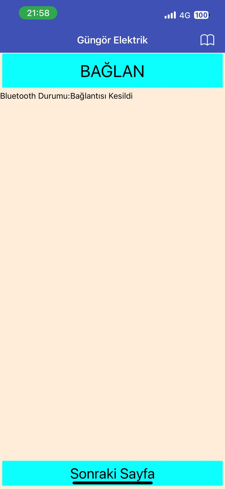
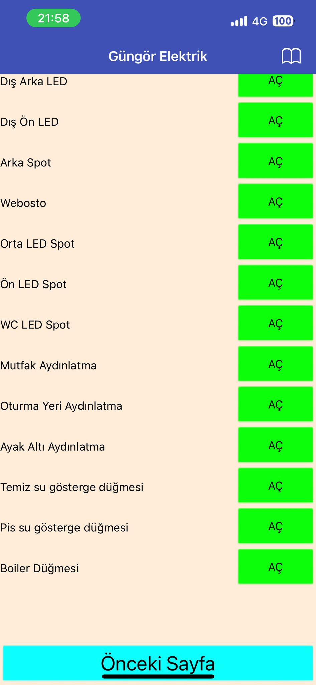
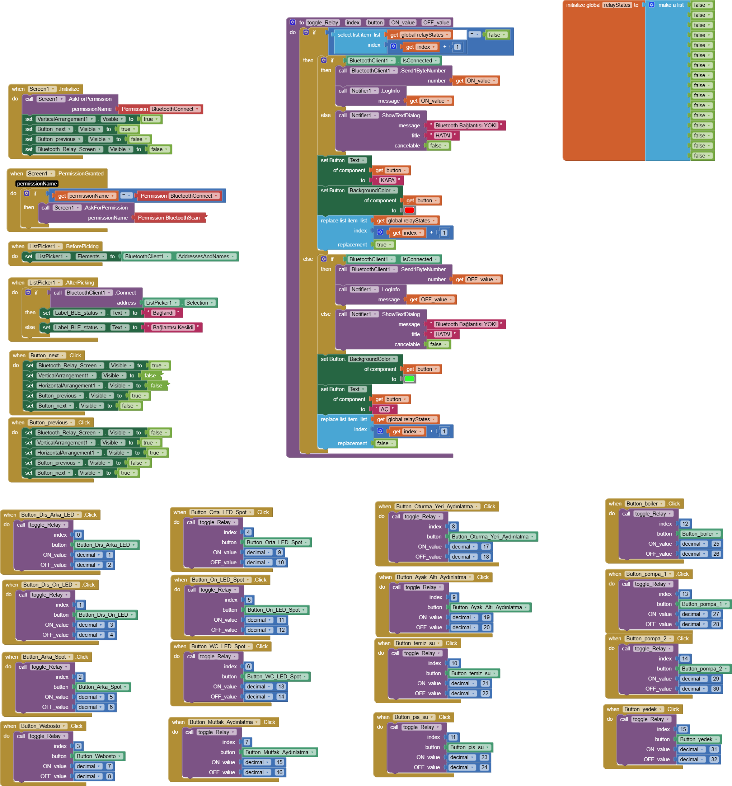

# 🚐 ESP32 Van Kontrol Sistemi

Bu proje, karavan tipi araçlarda 16 farklı elektrikli donanımı kontrol etmek için geliştirilmiş bir **Bluetooth tabanlı mobil kontrol sistemidir**. Kullanıcı, Android tabanlı mobil uygulama üzerinden butonlara basarak aydınlatma, pompa, göstergeler ve ısıtıcı gibi birimleri açıp kapatabilir. ESP32 mikrodenetleyicisi Bluetooth üzerinden gelen komutları okuyarak ilgili GPIO pinlerine bağlı röleleri kontrol eder.

## 📱 Mobil Uygulama Özellikleri

Mobil uygulama **MIT App Inventor** platformunda geliştirilmiştir. Uygulama:

- Bluetooth bağlantısı kurar
- 16 adet buton ile her donanım için AÇ / KAPA kontrolü sağlar
- Her butonun durumu renk ve yazı ile gösterilir
- Bluetooth bağlantısı yoksa kullanıcıyı uyarır
- Görsel arayüz sade ve kullanışlıdır

### 🔧 Uygulama Arayüzü




### 🔧 Blok Kod Yapısı

Tüm butonlar `ToggleRelay` adlı ortak bir prosedür üzerinden çalışır.



---

## 🔌 ESP32 Donanım Yapısı

ESP32 Bluetooth üzerinden gelen komutlara göre aşağıdaki GPIO pinlerine bağlı röleleri kontrol eder:

| Röle No | GPIO | Fonksiyon                    |
|---------|------|-------------------------------|
| 1       | 13   | Dış Arka LED                 |
| 2       | 12   | Dış Ön LED                   |
| 3       | 14   | Arka Spot                    |
| 4       | 27   | Webosto                      |
| 5       | 26   | Orta LED Spot                |
| 6       | 25   | Ön LED Spot                  |
| 7       | 33   | WC LED Spot                  |
| 8       | 32   | Mutfak Aydınlatma            |
| 9       | 15   | Oturma Yeri Aydınlatma       |
| 10      | 2    | Ayak Altı Aydınlatma         |
| 11      | 4    | Temiz Su Göstergesi          |
| 12      | 16   | Pis Su Göstergesi            |
| 13      | 17   | Boiler                       |
| 14      | 5    | Pompa 1                      |
| 15      | 18   | Pompa 2                      |
| 16      | 19   | Yedek                        |

---

## 🧠 Komut Protokolü

- **Tek sayı (örn: 1, 3, 5...)** → AÇ komutu
- **Çift sayı (örn: 2, 4, 6...)** → KAPA komutu

**Örnek:**  
- `1` gönderilirse → GPIO13 HIGH (Dış Arka LED Açılır)  
- `2` gönderilirse → GPIO13 LOW (Dış Arka LED Kapanır)

---

## 💻 ESP32 Kod Yapısı

Kodlar VSCode eklentisi olan PlatformIO da yazılmıştır. Röle pinleri `relayPins[]` dizisinde tutulur. Komutlar işlendikten sonra ilgili röleye HIGH/LOW sinyali gönderilir.

### 📦 ESP32 Kodu

```cpp
#include "Arduino.h"
#include "BluetoothSerial.h"

#if !defined(CONFIG_BT_ENABLED) || !defined(CONFIG_BLUEDROID_ENABLED)
#error Bluetooth is not enabled!
#endif

BluetoothSerial SerialBT;

const int relayPins[] = {13, 12, 14, 27, 26, 25, 33, 32, 15, 2, 4, 16, 17, 5, 18, 19}; 
const int relayCount = sizeof(relayPins) / sizeof(relayPins[0]);

void setup() {
  Serial.begin(115200);
  SerialBT.begin("ESP32-VanControl");

  for (int i = 0; i < relayCount; i++) {
    pinMode(relayPins[i], OUTPUT);
    digitalWrite(relayPins[i], LOW);
  }

  Serial.println("Basladi...");
}

void loop() {
  if (Serial.available()) {
    SerialBT.write(Serial.read());
  }

  if (SerialBT.available()) {
    int cmd = SerialBT.read();
    delay(20);

    int index = (cmd - 1) / 2;

    if (index >= 0 && index < relayCount) {
      bool state = (cmd % 2 == 1);
      digitalWrite(relayPins[index], state ? HIGH : LOW);

      Serial.print("Röle ");
      Serial.print(index + 1);
      Serial.println(state ? " açıldı" : " kapatıldı");
    } else {
      Serial.print("Geçersiz komut: ");
      Serial.println(cmd);
    }
  }

  delay(20);
}
```

---

## 🛠️ Gereksinimler

- ESP32 Geliştirme Kartı
- 16 kanal röle kartı
- Android telefon
- MIT App Inventor (mobil uygulama oluşturmak için)
- VSCode Platform IO veya Arduino IDE (ESP32 programlama için)

---

## 📦 Lisans

Bu proje kişisel kullanım için geliştirilmiştir. Ticari kullanımda telif haklarına dikkat ediniz.
